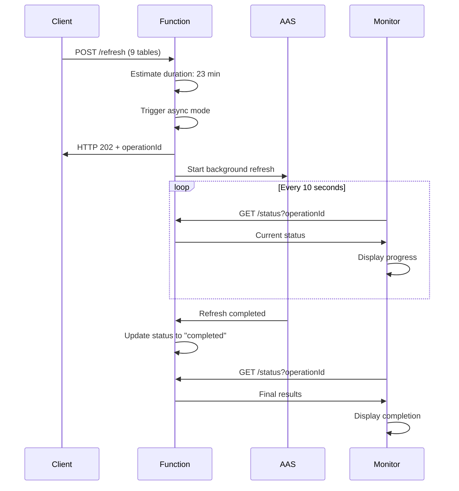

# 🚀 Enhanced AAS Refresh Operation Flow

## 📋 **System Overview**

The enhanced system provides **real-time operation tracking** with detailed status monitoring for Azure Analysis Services refresh operations. Each operation gets a unique ID and can be monitored throughout its lifecycle.

## 🔄 **Execution Flow Diagram**

```
┌─────────────────────────────────────────────────────────────────────────────┐
│                           CLIENT REQUEST                                   │
│  POST /api/DHRefreshAAS_HttpStart                                         │
│  Body: { database_name, refresh_objects[] }                              │
└─────────────────────────────────────────────────────────────────────────────┘
                                    │
                                    ▼
┌─────────────────────────────────────────────────────────────────────────────┐
│                        REQUEST VALIDATION                                  │
│  ✓ Parse JSON body                                                        │
│  ✓ Validate database name                                                 │
│  ✓ Validate refresh objects                                               │
│  ✓ Estimate operation duration                                            │
└─────────────────────────────────────────────────────────────────────────────┘
                                    │
                                    ▼
┌─────────────────────────────────────────────────────────────────────────────┐
│                    PROCESSING PATTERN                                      │
│                                                                             │
│  ALWAYS → Use ASYNC Response Pattern                                       │
│           (Ensures operationId generation for Logic App tracking)          │
│                                                                             │
│  Note: Synchronous processing has been removed to ensure consistent        │
│        operation tracking and better integration with Logic Apps           │
└─────────────────────────────────────────────────────────────────────────────┘
                                    │
                                    ▼
┌─────────────────────────────────────────────────────────────────────────────┐
│                    ASYNC PATH (HTTP 202)                                   │
│                                                                             │
│  1. Generate Operation ID (GUID)                                          │
│  2. Create OperationStatus record                                         │
│  3. Start background Task.Run()                                           │
│  4. Return immediate response with operationId                            │
│                                                                             │
│  Response: { operationId, status: "accepted", estimatedDurationMinutes }   │
└─────────────────────────────────────────────────────────────────────────────┘
                                    │
                                    ▼
┌─────────────────────────────────────────────────────────────────────────────┐
│                    SYNCHRONOUS PATH (HTTP 200)                             │
│                                                                             │
│  1. Execute refresh operation directly                                     │
│  2. Wait for completion                                                    │
│  3. Return detailed results                                                │
│                                                                             │
│  Response: { isSuccess, detailedResult, summary }                         │
└─────────────────────────────────────────────────────────────────────────────┘
                                    │
                                    ▼
┌─────────────────────────────────────────────────────────────────────────────┐
│                    BACKGROUND PROCESSING                                   │
│  (Async operations only)                                                  │
│                                                                             │
│  1. Execute AAS refresh with retry logic                                  │
│  2. Update OperationStatus on completion                                  │
│  3. Store detailed results or error messages                              │
│  4. Log completion status                                                 │
└─────────────────────────────────────────────────────────────────────────────┘
                                    │
                                    ▼
┌─────────────────────────────────────────────────────────────────────────────┐
│                    STATUS MONITORING                                       │
│                                                                             │
│  GET /api/DHRefreshAAS_Status?operationId={id}                            │
│                                                                             │
│  Returns: { status, elapsedMinutes, result, errorMessage, isCompleted }   │
└─────────────────────────────────────────────────────────────────────────────┘
```

## 🎯 **Operation Lifecycle States**

| State | Description | Next States |
|-------|-------------|-------------|
| **`running`** | Operation is executing in background | `completed` or `failed` |
| **`completed`** | Operation finished successfully | Final state |
| **`failed`** | Operation encountered an error | Final state |

## 📊 **Enhanced Progress Tracking**

| Metric | Description | Example |
|--------|-------------|---------|
| **Progress Percentage** | Real-time completion percentage | `45.5%` |
| **Tables Completed** | Number of successfully processed tables | `3/6` |
| **Tables Failed** | Number of tables that failed to process | `1` |
| **Tables In Progress** | Number of tables currently being processed | `2` |
| **Completed Tables List** | Names of successfully processed tables | `["Table1", "Table2", "Table3"]` |
| **Failed Tables List** | Names and error messages for failed tables | `["Table4: Connection timeout"]` |
| **In Progress Tables** | Names of tables currently being processed | `["Table5", "Table6"]` |

## 📊 **API Endpoints**

### 1. **Start Refresh Operation**
```http
POST /api/DHRefreshAAS_HttpStart
Content-Type: application/json

{
  "database_name": "VN_CubeModel",
  "refresh_objects": [
    {"table": "Exchange Rate", "partition": ""},
    {"table": "SalesNAV", "partition": "fSalesNAV_202508"}
  ]
}
```

**Response (Async):**
```json
{
  "operationId": "e9698201-ab0a-4dd5-8e45-0a54146551cd",
  "status": "accepted",
  "message": "Refresh operation started in background. Use status endpoint to monitor progress.",
  "estimatedDurationMinutes": 23
}
```

**Response (Sync):**
```json
{
  "isSuccess": true,
  "detailedResult": "{...}",
  "summary": "All tables/partitions refreshed successfully. Total time: 45.23 seconds"
}
```

### 2. **Check Operation Status**
```http
GET /api/DHRefreshAAS_Status?operationId={operationId}
```

**Response:**
```json
{
  "operationId": "e9698201-ab0a-4dd5-8e45-0a54146551cd",
  "status": "running",
  "startTime": "2024-01-15T13:20:00Z",
  "endTime": null,
  "elapsedMinutes": 12.5,
  "estimatedDurationMinutes": 23,
  "tablesCount": 9,
  
  "progress": {
    "percentage": 33.3,
    "completed": 3,
    "failed": 0,
    "inProgress": 6,
    "completedTables": ["Exchange Rate", "SalesNAV", "Production Transaction"],
    "failedTables": [],
    "inProgressTables": ["ANA vw_SalesSM_result", "ANA complaintmanagement", "ANA sourceofgrowth", "VNWH vw_fSalesNAVWithFactory", "SalesNAV", "SalesNAV"]
  },
  
  "result": null,
  "errorMessage": null,
  "isCompleted": false
}
```

### 3. **General Status Overview**
```http
GET /api/DHRefreshAAS_Status
```

**Response:**
```json
{
  "timestamp": "2024-01-15T13:32:00Z",
  "status": "Function is running",
  "totalOperations": 5,
  "runningOperations": 2,
  "completedOperations": 2,
  "failedOperations": 1,
  "recentOperations": [...],
  "endpoints": {...}
}
```

## 🛠️ **Usage Examples**

### **Example 1: Start and Monitor Operation**
```powershell
# 1. Start refresh operation
$body = @{
    database_name = "VN_CubeModel"
    refresh_objects = @(
        @{ table = "Exchange Rate"; partition = "" }
        @{ table = "SalesNAV"; partition = "fSalesNAV_202508" }
    )
} | ConvertTo-Json

$response = Invoke-RestMethod -Uri $refreshUrl -Method POST -Body $body -Headers @{'Content-Type'='application/json'}

# 2. Get operation ID
$operationId = $response.operationId
Write-Host "Operation started: $operationId"

# 3. Monitor progress
.\monitor_operation_enhanced.ps1 -OperationId $operationId -CheckIntervalSeconds 15
```

### **Example 2: Quick Status Check**
```powershell
# Check specific operation
$status = Invoke-RestMethod -Uri "$statusUrl?operationId=$operationId" -Method GET
Write-Host "Status: $($status.status)"
Write-Host "Elapsed: $($status.elapsedMinutes) minutes"

# Check all operations
$overview = Invoke-RestMethod -Uri $statusUrl -Method GET
Write-Host "Running: $($overview.runningOperations)"
Write-Host "Completed: $($overview.completedOperations)"
```

### **Example 3: Continuous Monitoring**
```powershell
# Monitor continuously (even after completion)
.\monitor_operation_enhanced.ps1 -OperationId $operationId -Continuous -CheckIntervalSeconds 30
```

## 🔍 **Monitoring Scripts**

### **Enhanced Monitor (`monitor_operation_enhanced.ps1`)**
- **Real-time status updates** every 10 seconds (configurable)
- **Status change detection** with visual alerts
- **Detailed result parsing** when operations complete
- **Error handling** with fallback to general status
- **Continuous mode** for ongoing monitoring

**Usage:**
```powershell
# Basic monitoring
.\monitor_operation_enhanced.ps1 -OperationId "your-operation-id"

# Custom interval
.\monitor_operation_enhanced.ps1 -OperationId "your-operation-id" -CheckIntervalSeconds 30

# Continuous monitoring
.\monitor_operation_enhanced.ps1 -OperationId "your-operation-id" -Continuous
```

## 📈 **Performance Metrics**

### **Operation Duration Estimation**
```
Base Time: 5 minutes
Per Table/Partition: +2 minutes
Maximum: 90 minutes
```

**Examples:**
- 1 table: ~7 minutes
- 3 tables: ~11 minutes → **Triggers async mode**
- 9 tables: ~23 minutes → **Triggers async mode**

### **Async Response Triggers**
- `ENABLE_ASYNC_RESPONSE = true` (forced)
- Estimated duration > 15 minutes
- Number of tables ≥ 3

## 🚨 **Error Handling**

### **Operation Failures**
- **Deadlock retries** with exponential backoff
- **Timeout handling** for long operations
- **Detailed error messages** stored in operation status
- **Fallback mechanisms** for status checks

### **Status Check Failures**
- **Retry logic** for temporary network issues
- **Fallback to general status** endpoint
- **Graceful degradation** with error reporting

## 🔧 **Configuration Options**

### **Environment Variables**
```json
{
  "ENABLE_ASYNC_RESPONSE": "false",
  "MAX_SAVE_CHANGES_RETRIES": "3",
  "SAVE_CHANGES_RETRY_DELAY_MS": "1000",
  "HTTP_CLIENT_TIMEOUT_MINUTES": "120"
}
```

### **Request-Level Overrides**
```json
{
  "database_name": "VN_CubeModel",
  "refresh_objects": [...],
  "MaxRetryAttempts": 5,
  "BaseDelaySeconds": 2,
  "ConnectionTimeoutMinutes": 30,
  "OperationTimeoutMinutes": 180
}
```

## 📝 **Best Practices**

### **For Development**
1. **Use small requests** (1-2 tables) for testing
2. **Monitor logs** in Azure Portal for detailed execution info
3. **Test both sync and async paths** to ensure reliability

### **For Production**
1. **Use async mode** for operations with 3+ tables
2. **Implement proper error handling** in client applications
3. **Monitor operation status** regularly during long operations
4. **Set appropriate timeouts** based on your data size

### **For Monitoring**
1. **Start monitoring immediately** after getting operation ID
2. **Use appropriate check intervals** (10-30 seconds recommended)
3. **Implement status change notifications** for critical operations
4. **Store operation IDs** for audit purposes

## 🔄 **Complete Workflow Example**



## 🎉 **Benefits of Enhanced System**

1. **Real-time visibility** into operation progress
2. **Predictable behavior** with clear async/sync decision logic
3. **Detailed result tracking** for audit and debugging
4. **Robust error handling** with retry mechanisms
5. **Flexible monitoring** with configurable intervals
6. **Production-ready** with proper status management
7. **Easy integration** with existing monitoring systems

## 🚀 **Enhanced Progress Tracking Features**

### **Real-Time Progress Updates**
- **Live percentage tracking** showing completion progress
- **Table-by-table status** with individual success/failure tracking
- **Dynamic progress calculation** updated after each table completion
- **Immediate feedback** on successful saves and failures

### **Comprehensive Status Information**
- **Tables completed count** - How many tables processed successfully
- **Tables failed count** - How many tables encountered errors
- **Tables in progress** - How many tables are currently being processed
- **Individual table names** - Complete list of completed, failed, and in-progress tables

### **Progress Monitoring Benefits**
- **Operational visibility** - Know exactly which tables are done and which are pending
- **Early error detection** - Identify failures before the entire operation completes
- **Resource planning** - Understand how much work remains
- **Audit trail** - Complete record of what succeeded and what failed
- **Performance insights** - Track processing speed and identify bottlenecks
