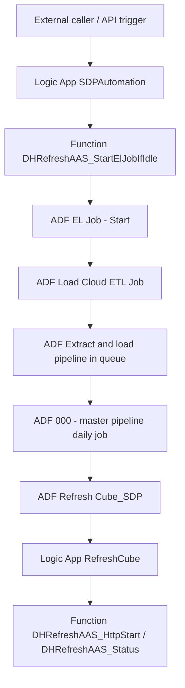

# ADF Architecture And Runbook

This is the canonical ADF-focused document for the live environment behind `DHRefreshAAS`.

It captures:

- the live orchestration chain
- the purpose of each important ADF/Logic App component
- the protections added to stop duplicate orchestrator runs
- the recovery model around `MasterEtlLineageKey`
- the current health snapshot
- the operator runbook for checking whether ADF is healthy or failing

Last reviewed: `2026-03-31`

## 1. Live Resource Map

| Resource | Value |
|---|---|
| Subscription | `8730775e-045c-47d1-a080-e3b9882cec01` |
| Resource group | `vn-rg-sa-sdp-solution-p` |
| Data Factory | `vn-adf-sa-sdp-solution-p-42` |
| Function App | `vn-fa-sa-sdp-p-aas` |
| Logic App: orchestrator entry | `SDPAutomation` |
| Logic App: refresh endpoint | `RefreshCube` |
| SQL Server | `vn-sql-sa-sdp-solution-p-01` |
| SQL database | `datalakeprod` |

## 2. End-To-End Flow

Interpretation:

- `SDPAutomation` is the outer entry point for ETL orchestration.
- `DHRefreshAAS_StartElJobIfIdle` is now the hard gate that decides whether ADF may start another `EL Job - Start`.
- `EL Job - Start` drains the ETL queue in a loop.
- `Load Cloud ETL Job` picks one pending SQL job when no SQL job is already marked `RUNNING`.
- `Extract and load pipeline in queue` prepares SQL control state, runs the master pipeline, restores control tables, and links the master run back to `SSISJobInfo`.
- `000 - master pipeline daily job` is the extract/load master. Its live refresh branch is `Refresh Cube_SDP`.
- `Refresh Cube_SDP` triggers the `RefreshCube` Logic App, which in turn calls the Azure Function refresh API.

## 3. Component Inventory

### `SDPAutomation`

Purpose:

- receives the outer HTTP trigger
- no longer calls ADF `CreateRun` directly
- now calls the function gate endpoint instead

Current protection model:

- Request trigger concurrency is enabled with:
  - `operationOptions = PersistRequestContextForConcurrencyControl`
  - `runtimeConfiguration.concurrency.runs = 1`
  - `runtimeConfiguration.concurrency.maximumWaitingRuns = 1`
- workflow body is intentionally minimal: one HTTP action to the gate endpoint

Operational meaning:

- even if `SDPAutomation` receives two requests almost at the same time, only the gate endpoint decides whether another orchestrator run is allowed

### `DHRefreshAAS_StartElJobIfIdle`

Purpose:

- prevents duplicate `EL Job - Start` runs

How it works:

1. acquires a queue lease in Azure Table Storage
2. queries ADF for active `EL Job - Start` runs using server-side filters on:
   - `PipelineName = EL Job - Start`
   - `Status in (InProgress, Queued, Canceling)`
3. if an active run already exists, returns `already-active`
4. otherwise starts `EL Job - Start`
5. waits briefly for the new run to become visible
6. releases the lease

Important note:

- this gate exists because Logic App-only pre-checks were still vulnerable to ADF eventual consistency and could still create `1 InProgress + 1 Queued`

### `EL Job - Start`

Purpose:

- top-level ADF orchestrator that keeps pulling ETL work until no pending SQL jobs remain

Live behavior:

- pipeline `concurrency = 1`
- main activity is an `Until` loop named `Until out of pending jobs`
- it repeatedly:
  - checks pending SQL jobs count
  - executes `Load Cloud ETL Job`
  - waits 3 minutes
  - rechecks pending SQL jobs count

Important implementation details:

- the earlier pre-check lookup `LookupPendingJobsCheck` is now intentionally inactive
- the loop completion condition is based on `LookupPendingJobsRecheck.output.firstRow.PendingJobsCount`

### `Load Cloud ETL Job`

Purpose:

- reads one pending job from `SSISJobInfo`
- only picks work if no job is already marked `RUNNING`
- either executes `Extract and load pipeline in queue` or waits briefly

Current safe expression:

- `Check PENDING Jobs` now uses
  - `@contains(string(activity('LookUpPendingJob').output), 'firstRow')`
- this replaced the older brittle expression that tried to dereference `output.firstRow` directly

Why this matters:

- on `2026-03-27`, repeated failures happened because `firstRow` did not exist when lookup returned no row

### `Extract and load pipeline in queue`

Purpose:

- updates SQL job status to `RUNNING`
- calls the master pipeline
- restores ETL control table state on both success and failure
- writes the resolved `MasterPipelineRunId`, `LineageKey`, and `LastLinkedDateUtc` back to `SSISJobInfo`

Operational meaning:

- this pipeline is the bridge between SQL queue rows and master lineage state
- it is also where correlation for later recovery decisions is persisted

Important hardening added on `2026-03-31`:

- the pipeline now explicitly handles early failure paths after the SQL job is set to `RUNNING`
- if `Backup ControlLoadTable` fails, the pipeline attempts restore and then marks the SQL row `FAILED`
- if either restore step fails, the pipeline still marks the SQL row `FAILED`
- this closes the stale-`RUNNING` hole that previously blocked all later pending jobs

### `000 - master pipeline daily job`

Purpose:

- performs the actual extract + load master flow
- updates lineage and settings
- triggers refresh only after successful ETL completion

Current live refresh branch:

- active branch: `Refresh Cube_copy1` -> child pipeline `Refresh Cube_SDP`
- legacy inactive branch: `Refresh Cube New`

Current documentation baked into the pipeline:

- pipeline description says the live path is `Refresh Cube_SDP`
- `Refresh Cube New` description says it is legacy and intentionally inactive

### `Refresh Cube_SDP`

Purpose:

- makes one web call to the `RefreshCube` Logic App with `MasterEtlLineageKey`

Operational meaning:

- ADF does not refresh AAS directly here
- it delegates to the existing refresh Logic App and Function flow

## 4. Current Protection Model

The live anti-duplicate model is now layered:

1. `SDPAutomation` trigger concurrency reduces concurrent request execution.
2. `DHRefreshAAS_StartElJobIfIdle` uses an Azure Table lease so only one dispatch check can run at a time.
3. the gate queries ADF for already-active orchestrator runs before starting a new one.
4. `EL Job - Start` itself has `concurrency = 1`.

This is the first model that proved stable in live testing:

- two direct calls to the gate endpoint produced:
  - first call: `started`
  - second call: `already-active`
- two direct calls to `SDPAutomation` produced:
  - two successful Logic App runs
  - only one active `EL Job - Start` in ADF

## 5. Recovery Model Around `MasterEtlLineageKey`

The live recovery path is SQL-driven, not ADF-expression-driven.

Main objects:

- `ETL.MasterEtlGetLineageKey`
- `ETL.MasterLineageOverride`
- `ETL.p_GrantMasterLineageOverride`
- `ETL.MasterAutoRecoveryPolicy`
- `ETL.p_GetMasterAutoRecoveryDecision`

Current behavior:

- if the previous lineage is already completed, next lineage opens normally
- if the latest lineage is `MASTER FAILED`, recovery is evaluated from SQL evidence
- automatic reopen is allowed only when policy says the failure is transient-only and safe
- otherwise the decision stays manual

What `ETL.p_GetMasterAutoRecoveryDecision` currently checks:

- current lineage status
- related `SSISJobInfo` row
- related job status
- transient vs deterministic ETL failure counts
- cooldown window
- retry budget
- whether an active override already exists

Important implication:

- ADF now depends on auditable SQL recovery decisions, not on ad hoc manual reruns only

## 6. Current Health Snapshot

Snapshot taken on `2026-03-31`.

### ADF status now

What was observed:

- no active `Failed`, `Queued`, or `Canceling` pipeline runs were returned from the broad latest-state query at the time of inspection
- recent `Load Cloud ETL Job` runs over the last two days were all `Succeeded`
- recent `000 - master pipeline daily job` runs over the last two days were mostly `Succeeded`
- one current `EL Job - Start` run is still `InProgress`:
  - `57bb647c-350e-4f7d-9596-d52e5c2ebe68`

### Why the current in-progress run does not currently look broken

Activity history for the active run showed:

- `Until out of pending jobs` is `InProgress`
- each `Execute Load Cloud ETL Job` iteration is `Succeeded`
- each follow-up `Wait3mins` is behaving normally
- there was no current activity-level error message in this run

Interpretation:

- this looks like a normal queue-drain cycle, not the older “stuck forever while failing internally” pattern

### SQL queue status now

At the same time, `SSISJobInfo` still showed:

- `RUNNING`: 1
- `PENDING`: 10
- `FAILED`: 6

Interpretation:

- ADF itself is healthier than before
- the ETL queue is not empty yet
- the remaining SQL queue backlog should not be confused with “ADF is currently failing”

## 7. Proven Good End-To-End Anchor

The latest fully successful anchor confirmed during this investigation was:

- master pipeline run: `3cb4bfcd-3e9a-4736-a9d3-a5ea1805355b`
- lineage key: `29506`
- child refresh pipeline run: `9827682c-6a85-495e-9d1f-bcd8a0e2a029`
- `Refresh Cube_SDP` web activity returned HTTP `202` from Logic App `RefreshCube`

This proves the intended happy path is currently valid:

`master succeeded` -> `Refresh Cube_SDP succeeded` -> `RefreshCube Logic App accepted`

## 8. Historical Failure Timeline

These are the main failures worth remembering. They are not all still active now.

### 8.1 `LookUpPendingJob.output.firstRow` failure

Seen repeatedly on `2026-03-27`.

Failure shape:

- `Load Cloud ETL Job` failed in `Check PENDING Jobs`
- expression tried to evaluate `activity('LookUpPendingJob').output.firstRow`
- lookup output did not contain `firstRow`

Impact:

- `EL Job - Start` failed upstream

Live fix:

- switch to `@contains(string(activity('LookUpPendingJob').output), 'firstRow')`

### 8.2 `Cannot get LineageKey ... last run was not completed`

Seen on `2026-03-27`.

Failure shape:

- `000 - master pipeline daily job` failed at `Get MasterEtlLineageKey`
- message referenced previous status such as `EXTRACT FAILED`

Impact:

- whole ETL chain blocked until lineage recovery was addressed

Live fix direction:

- SQL override + auto-recovery policy model
- durable job-to-lineage correlation in `SSISJobInfo`

### 8.3 Overlapping master runs while latest lineage was still `MASTER STARTED`

Seen on `2026-03-30 13:18`.

Failure shape:

- one `000 - master pipeline daily job` failed with:
  - `Cannot get LineageKey ... status of last run = MASTER STARTED`
  - `RecoveryDecision=ManualResolutionRequired`

Interpretation:

- this was a concurrency collision, not a data defect

Why it matters:

- this is strong evidence for why the outer hard gate was required

### 8.4 `Backup ControlLoadTable` severe SQL error

Seen in `Extract and load pipeline in queue` on `2026-03-30 17:59`.

Failure shape:

- `Backup ControlLoadTable` failed with:
  - `A severe error occurred on the current command`

Interpretation:

- this looks like a lower-level SQL execution issue
- it should be treated as a SQL-side incident if it starts recurring

Why it caused the queue to stick:

- `UPDATE JOB STATUS TO RUNNING` executed before `Backup ControlLoadTable`
- when `Backup ControlLoadTable` failed, the old pipeline had no failure branch that reset the SQL row to `FAILED`
- the affected row stayed `RUNNING` forever
- `EL Job - Start` kept looping because `PENDING > 0`, while `Load Cloud ETL Job` refused to pick another job because a `RUNNING` row still existed

Live fix applied:

- `Extract and load pipeline in queue` was patched so early failures now route through explicit cleanup activities:
  - restore-on-backup-failure
  - mark failed after backup-failure cleanup
  - mark failed if restore-on-success fails
  - mark failed if restore-on-failure fails
- the stale row `JobID = 18247` was manually restored to a safe state and changed from `RUNNING` to `FAILED`
- after that cleanup, the queue resumed and `JobID = 18248` moved to `RUNNING`

## 9. How To Check Whether ADF Is Healthy

### Quick rule of thumb

ADF is currently healthy enough when all of the following are true:

- no new `Failed` runs are appearing in:
  - `EL Job - Start`
  - `Load Cloud ETL Job`
  - `Extract and load pipeline in queue`
  - `000 - master pipeline daily job`
- the active `EL Job - Start` run keeps advancing through:
  - `Execute Load Cloud ETL Job`
  - `Wait3mins`
  - `LookupPendingJobsRecheck`
- successful master runs continue to produce successful `Refresh Cube_SDP` runs

### Practical check order

1. Check recent failed pipeline runs in ADF.
2. Check whether there is more than one active `EL Job - Start`.
3. If one active `EL Job - Start` exists, inspect its activity runs.
4. Check recent `000 - master pipeline daily job` runs.
5. If master succeeded, confirm `Refresh Cube_SDP` succeeded.
6. Separately inspect `SSISJobInfo` to understand whether SQL still has backlog.

### Interpreting the current active orchestrator

If `EL Job - Start` is still `InProgress` but:

- `Execute Load Cloud ETL Job` keeps succeeding
- `Wait3mins` keeps moving
- no activity-level errors appear

then the run is more likely draining queue normally than hanging.

## 10. Remaining Risks

These are the risks that still remain even after the duplicate-run fix.

### SQL queue backlog is still real

- `SSISJobInfo` still contained `PENDING`, `RUNNING`, and some `FAILED` rows during this review
- ADF can be healthy while SQL backlog still exists

### `Extract and load pipeline in queue` can still fail on SQL-side operations

- the `Backup ControlLoadTable` severe SQL error is not explained by ADF orchestration alone

### Some failed `SSISJobInfo` rows have no lineage link

- several current failed rows still have `LineageKey = NULL`
- that weakens later recovery/troubleshooting for those specific rows

### Secrets must stay out of tracked docs

- Logic App signed trigger URLs and Function keys exist in live definitions
- document behavior, but never store the live secrets in repo docs

## 11. Recommended Operator Response

Use this response model:

### If there is exactly one active `EL Job - Start` and it is progressing

- do not cancel it immediately
- first confirm whether it is looping normally and reducing backlog

### If a second `EL Job - Start` appears again

- treat that as a regression in the outer gate
- inspect:
  - `SDPAutomation`
  - `DHRefreshAAS_StartElJobIfIdle`
  - Azure Table lease behavior

### If master pipeline fails at `Get MasterEtlLineageKey`

- inspect the latest lineage state
- inspect `ETL.p_GetMasterAutoRecoveryDecision`
- decide whether the failure is:
  - safe auto-recovery candidate
  - manual-resolution-only

### If `Backup ControlLoadTable` starts recurring

- treat it as a SQL/database issue first
- engage the SQL team with the failing run IDs and timestamps

## 12. Related Documents

Use these files together with this runbook:

- `docs/LogicApp_RefreshCube_FullFlow.md`
- `docs/ProjectSessionResume.md`
- `docs/MasterModelHandoff.md`
- `docs/AzureCliAndDatabaseOperations.md`
- `docs/SaveChangesFailureEvidence.md`
- `docs/EnvironmentRoutingAudit.md`

