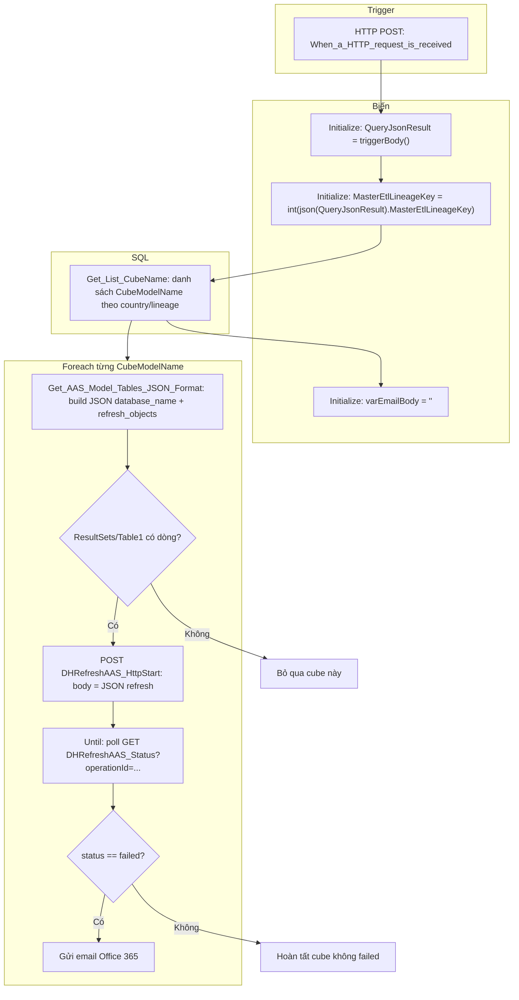

# Luồng đầy đủ: Logic App Refresh Cube + Azure Function DHRefreshAAS

Tài liệu này mô tả **toàn bộ luồng** từ HTTP trigger → SQL → Azure Function `DHRefreshAAS_HttpStart` → poll `DHRefreshAAS_Status` → email khi lỗi, đã **đồng bộ** với code Function hiện tại và các **chỉnh sửa nên áp dụng** trong Logic App (tên cột SQL, casing, schema JSON).

**Export workflow (portal):** Định nghĩa đầy đủ `definition` + `parameters` ($connections) khớp bản export có trong [LogicApp_RefreshCube_Workflow.json](LogicApp_RefreshCube_Workflow.json) và trong mục [Export JSON (definition + parameters)](#export-json-definition--parameters) bên dưới (hai nguồn cùng nội dung). Tóm tắt: `foreach` dùng `body('Get_List_CubeName')?['resultsets']?['Table1']`; điều kiện “không refresh” khi `@empty(...?['ResultSets'])`; POST Function lấy cột `JSON_F52E2B61_...`; Compose email dùng `@json(replace(..., '\r\n', ''))`; biểu thức Append mail gọn một dòng (tương đương bản designer nhiều dòng).

---

## Sơ đồ tổng quan



---

## 1. Trigger HTTP

| Mục | Giá trị |
|-----|--------|
| Loại | Request, kind Http |
| Method | **POST** |
| Body mong đợi | JSON có **`MasterEtlLineageKey`** (số nguyên), ví dụ: `{"MasterEtlLineageKey": 12345}` |

**Lưu ý:** Expression `int(json(variables('QueryJsonResult')).MasterEtlLineageKey)` yêu cầu `QueryJsonResult` là chuỗi JSON hợp lệ chứa field đó. Nếu body không đúng format, bước sẽ fail sớm.

---

## 2. Khởi tạo biến

1. **`QueryJsonResult`**  
   - Gán `@triggerBody()` (hoặc `string(triggerBody())` nếu cần chuẩn hóa).

2. **`MasterEtlLineageKey`**  
   - `@int(json(variables('QueryJsonResult')).MasterEtlLineageKey)`

3. **`varEmailBody`**  
   - Chuỗi rỗng, dùng nối nội dung mail khi refresh failed.

---

## 3. SQL: `Get_List_CubeName`

- **Mục đích:** Lấy danh sách `CubeModelName` từ `ETL.DataWarehouseAndCubeMapping` / `ETL.CountryModelCube`, filter theo `MasterEtlLineageKey` và country.

- **Logic App đọc kết quả:**  
  - Thường dùng: `body('Get_List_CubeName')?['body']?['resultsets']?['Table1']` hoặc tùy connector; **cần thống nhất một casing** (`resultsets` vs `ResultSets`) theo run thực tế trên portal.

- **Foreach:**  
  - `foreach` trên mảng dòng (mỗi dòng có `CubeModelName`).

---

## 4. Trong mỗi vòng Foreach (theo từng cube)

### 4.1. SQL: `Get_AAS_Model_Tables_JSON_Format`

- **Mục đích:** Sinh **một dòng JSON** đúng format mà Function `HttpStart` nhận: có **`database_name`** và **`refresh_objects`** (mảng object `table` / `partition`), khớp model [`PostData`](Models/PostData.cs) (`database_name`, `refresh_objects`).

- **Chỉnh sửa nên làm (sau khi edit SQL/Logic App):**  
  - Trong T-SQL `FOR JSON`, đặt **alias cố định** cho cột JSON output (ví dụ `AS RefreshPayload`) thay vì để SQL Server sinh tên dài kiểu `JSON_F52E2B61_...`.  
  - Trong Logic App, map body POST = **đúng một field** đó, ví dụ:  
    `body('Get_AAS_Model_Tables_JSON_Format')?['body']?['ResultSets']?['Table1'][0]?['RefreshPayload']`  
    (điều chỉnh theo đúng shape connector thực tế).

### 4.2. Điều kiện “có dữ liệu để refresh không?”

- Hiện tại: `empty(body('...')?['ResultSets'])` — cần **cùng casing** với response SQL connector (`ResultSets` / `resultsets`).

- **Nếu rỗng:** không gọi Function (bỏ qua cube).

- **Nếu có:** vào nhánh gọi Function.

### 4.3. Azure Function: `DHRefreshAAS_HttpStart`

| Mục | Giá trị |
|-----|--------|
| Method | **POST** |
| Body | Chuỗi JSON từ SQL (payload refresh), `Content-Type: application/json` |
| Auth | Theo cấu hình connector Function (thường function key / managed identity) |

**Response 202 (chuẩn code hiện tại)** — [`ResponseService.CreateAcceptedResponseAsync`](Services/ResponseService.cs):

```json
{
  "operationId": "<guid>",
  "status": "accepted",
  "message": "Refresh operation started in background. Use status endpoint to monitor progress.",
  "estimatedDurationMinutes": <int>,
  "statusUrl": "https://<host>/api/DHRefreshAAS_Status?operationId=<guid>"
}
```

Logic App cần đọc: **`body('DHRefreshAAS_HttpStart')?['operationId']`** (đúng camelCase như trên).

### 4.4. Vòng `Until`: poll `DHRefreshAAS_Status`

| Mục | Giá trị |
|-----|--------|
| Method | **GET** |
| Query | `operationId=@body('DHRefreshAAS_HttpStart')['operationId']` |

**Điều kiện thoát Until** (khớp code):

- `body('...Status')?['status']` là **`completed`** hoặc **`failed`** (giá trị chữ thường — xem [`OperationStatusEnum`](Enums/OperationStatusEnum.cs)), **hoặc**
- `body('...Status')?['isCompleted'] == true`  
  (`isCompleted` = true khi status khác `running` — xem [`GetSpecificOperationStatus`](Controllers/DHRefreshAASController.cs)).

**Gợi ý cấu hình:**

- `limit.count`: ví dụ 60  
- `limit.timeout`: ví dụ `PT1H`  
- Sau mỗi lần gọi Status: **Wait** 30 giây (như workflow hiện tại).

**Payload status (một phần)** — khi có `operationId`:

- `operationId`, `status`, `startTime`, `endTime`, `progress`, **`result`** (chuỗi JSON hoặc object tùy lưu trong storage), `errorMessage`, `isCompleted`.

Logic App dùng `result` để parse `RefreshResults` trong nhánh email — cần đảm bảo `json(replace(...))` khớp định dạng thực tế.

### 4.5. Điều kiện sau Until: `status == failed`

- **Đúng:** gửi mail (Office 365), body mail dùng `CubeModelName`, `startTime`, `endTime`, `operationId`, `status`, và loop `RefreshResults` nếu parse `result` thành công.

---

## 5. Khớp với Azure Function (tham chiếu code)

| Endpoint | File / hành vi |
|----------|----------------|
| `POST /api/DHRefreshAAS_HttpStart` | [`DHRefreshAASController.HttpStart`](Controllers/DHRefreshAASController.cs): tạo `operationId`, chạy refresh nền, trả 202 + `operationId`, `statusUrl`. |
| `GET /api/DHRefreshAAS_Status?operationId=` | [`GetSpecificOperationStatus`](Controllers/DHRefreshAASController.cs): trả `status`, `result`, `isCompleted`, v.v. |

---

## 6. Rủi ro đã được ghi nhận và cách xử lý “sau khi edit”

| Vấn đề | Cách xử lý trong tài liệu / workflow |
|--------|--------------------------------------|
| `resultsets` vs `ResultSets` | Chọn **một** casing theo response thật của SQL connector; dùng thống nhất mọi chỗ. |
| Tên cột JSON dài từ SQL | Đổi SQL sang **alias cố định**; Logic App chỉ map một tên. |
| HttpStart lỗi trước khi có `operationId` | Nên thêm nhánh **Scope / run after failed** để báo lỗi, không chỉ dựa Until. |
| Until hết count nhưng vẫn `running` | Cân nhắc gửi cảnh báo “timeout poll” hoặc tăng `count`/timeout. |
| `varEmailBody` + Foreach | Nếu cần thứ tự email ổn định, đặt **Degree of parallelism = 1** cho Foreach. |

---

## 7. Kiểm thử nhanh (ngoài Logic App)

1. Gọi trực tiếp Function (Postman) `POST .../api/DHRefreshAAS_HttpStart` với body giống SQL output.  
2. `GET .../api/DHRefreshAAS_Status?operationId=<guid>` cho đến khi `completed` / `failed`.  
3. So sánh field với expression trong Logic App.

---

## Export JSON (definition + parameters)

```json
{
  "definition": {
    "$schema": "https://schema.management.azure.com/providers/Microsoft.Logic/schemas/2016-06-01/workflowdefinition.json#",
    "contentVersion": "1.0.0.0",
    "triggers": {
      "When_a_HTTP_request_is_received": {
        "type": "Request",
        "kind": "Http",
        "inputs": {
          "method": "POST"
        }
      }
    },
    "actions": {
      "Get_List_CubeName": {
        "type": "ApiConnection",
        "inputs": {
          "host": {
            "connection": {
              "name": "@parameters('$connections')['sql']['connectionId']"
            }
          },
          "method": "post",
          "body": {
            "query": "SELECT c.CubeModelName\nFROM [ETL].[DataWarehouseAndCubeMapping] f\nJOIN [ETL].[CountryModelCube] c on f.CubeName = c.CubeModelName\nWHERE c.CountryKey IN (SELECT TOP 1 [MasterSettings_CountryKey] FROM [ETL].[vw_EtlLog] WHERE LineageKey = @{variables('MasterEtlLineageKey')}  AND [MasterSettings_CountryKey] IS NOT NULL)\nGROUP BY c.CubeModelName"
          },
          "path": "/v2/datasets/@{encodeURIComponent(encodeURIComponent('default'))},@{encodeURIComponent(encodeURIComponent('default'))}/query/sql"
        },
        "runAfter": {
          "MasterEtlLineageKey": ["Succeeded"]
        }
      },
      "Initialize_variables": {
        "type": "InitializeVariable",
        "inputs": {
          "variables": [
            {
              "name": "QueryJsonResult",
              "type": "string",
              "value": "@{triggerBody()}"
            }
          ]
        },
        "runAfter": {}
      },
      "MasterEtlLineageKey": {
        "type": "InitializeVariable",
        "inputs": {
          "variables": [
            {
              "name": "MasterEtlLineageKey",
              "type": "integer",
              "value": "@int(json(variables('QueryJsonResult')).MasterEtlLineageKey)"
            }
          ]
        },
        "runAfter": {
          "Initialize_variables": ["Succeeded"]
        }
      },
      "For_each": {
        "type": "Foreach",
        "foreach": "@body('Get_List_CubeName')?['resultsets']?['Table1']",
        "actions": {
          "Get_AAS_Model_Tables_JSON_Format": {
            "type": "ApiConnection",
            "inputs": {
              "host": {
                "connection": {
                  "name": "@parameters('$connections')['sql']['connectionId']"
                }
              },
              "method": "post",
              "body": {
                "query": "DECLARE @CountryKey INT = (SELECT TOP 1 MasterSettings_CountryKey FROM etl.vw_EtlLog etllog WHERE etllog.LineageKey = @{variables('MasterEtlLineageKey')} AND MasterSettings_CountryKey IS NOT NULL) \nSELECT cube.CubeName as database_name, \n        refresh_objects = JSON_QUERY(CONCAT('[', STRING_AGG(CONCAT('{\"table\":\"', STRING_ESCAPE(cube.CubeTableName, 'json'), '\"', ',', '\"partition\":\"', STRING_ESCAPE(cube.Partition, 'json'), '\"}'), ','), ']'))\nFROM\n(\n    SELECT Distinct SchemaName, TableName, @CountryKey AS CountryKey \n    FROM etl.vw_EtlLog etllog\n    WHERE etllog.LineageKey = @{variables('MasterEtlLineageKey')} \n        AND etllog.StageName = 'LOAD' \n        AND etllog.ActivityStatus = 'Succeeded' \n        AND coalesce(etllog.ActivityOutput_LoadInsertedRows, 0) \n            + coalesce(etllog.ActivityOutput_LoadUpdatedRows, 0) \n            + coalesce(etllog.ActivityOutput_LoadDeletedRows, 0) > 0\n    UNION\n    SELECT 'ETL' SchemaName, 'vw_EtlLog' TableName, @CountryKey AS CountryKey\n    UNION\n    SELECT SchemaName, TableName, @CountryKey AS CountryKey FROM etl.datawarehouseandcubemapping WHERE IsAlwayRefreshed = 1\n) etlLog\n    INNER JOIN etl.datawarehouseandcubemapping cube ON etllog.SchemaName=cube.SchemaName \n                                                    AND etllog.TableName=cube.TableName\n                                                    AND cube.CubeName = '@{items('For_each')?['CubeModelName']}'\nGROUP BY CubeName\nFOR JSON PATH, WITHOUT_ARRAY_WRAPPER"
              },
              "path": "/v2/datasets/@{encodeURIComponent(encodeURIComponent('default'))},@{encodeURIComponent(encodeURIComponent('default'))}/query/sql"
            }
          },
          "Condition": {
            "type": "If",
            "expression": {
              "and": [
                {
                  "equals": [
                    "@empty(body('Get_AAS_Model_Tables_JSON_Format')?['ResultSets'])",
                    "@true"
                  ]
                }
              ]
            },
            "actions": {},
            "else": {
              "actions": {
                "DHRefreshAAS_HttpStart": {
                  "type": "Function",
                  "inputs": {
                    "body": "@string(body('Get_AAS_Model_Tables_JSON_Format')?['ResultSets']['Table1'][0]['JSON_F52E2B61_x002d_18A1_x002d_11d1_x002d_B105_x002d_00805F49916B'])",
                    "method": "POST",
                    "headers": {
                      "Content-Type": "application/json"
                    },
                    "function": {
                      "id": "/subscriptions/8730775e-045c-47d1-a080-e3b9882cec01/resourceGroups/vn-rg-sa-sdp-solution-p/providers/Microsoft.Web/sites/vn-fa-sa-sdp-p-aas/functions/DHRefreshAAS_HttpStart"
                    }
                  }
                },
                "Until_Operation_Complete": {
                  "type": "Until",
                  "expression": "@or(equals(body('vn-fa-sa-sdp-p-aas-DHRefreshAAS_Status')?['status'], 'completed'), equals(body('vn-fa-sa-sdp-p-aas-DHRefreshAAS_Status')?['status'], 'failed'), equals(body('vn-fa-sa-sdp-p-aas-DHRefreshAAS_Status')?['isCompleted'], true))",
                  "limit": {
                    "count": 60,
                    "timeout": "PT1H"
                  },
                  "actions": {
                    "vn-fa-sa-sdp-p-aas-DHRefreshAAS_Status": {
                      "type": "Function",
                      "inputs": {
                        "method": "GET",
                        "queries": {
                          "operationId": "@{body('DHRefreshAAS_HttpStart').operationId}"
                        },
                        "function": {
                          "id": "/subscriptions/8730775e-045c-47d1-a080-e3b9882cec01/resourceGroups/vn-rg-sa-sdp-solution-p/providers/Microsoft.Web/sites/vn-fa-sa-sdp-p-aas/functions/DHRefreshAAS_Status"
                        }
                      }
                    },
                    "Delay": {
                      "type": "Wait",
                      "inputs": {
                        "interval": {
                          "count": 30,
                          "unit": "Second"
                        }
                      },
                      "runAfter": {
                        "vn-fa-sa-sdp-p-aas-DHRefreshAAS_Status": ["Succeeded"]
                      }
                    }
                  },
                  "runAfter": {
                    "DHRefreshAAS_HttpStart": ["Succeeded"]
                  }
                },
                "Condition_1": {
                  "type": "If",
                  "expression": {
                    "and": [
                      {
                        "equals": [
                          "@body('vn-fa-sa-sdp-p-aas-DHRefreshAAS_Status')?['status']",
                          "failed"
                        ]
                      }
                    ]
                  },
                  "actions": {
                    "Send_an_email_(V2)": {
                      "type": "ApiConnection",
                      "inputs": {
                        "host": {
                          "connection": {
                            "name": "@parameters('$connections')['office365']['connectionId']"
                          }
                        },
                        "method": "post",
                        "body": {
                          "To": "mina.my@deheus.com, Vincent.Quyen@deheus.com",
                          "Subject": "Refesh Cube Fail",
                          "Body": "<p class=\"editor-paragraph\">Dear Team,<br><br>Lỗi khi đang refresh Cube model : ( Cloud )<br><br>Quy trình RefreshCube đã gặp lỗi: @{items('For_each')?['CubeModelName']}<br><br>- CreatedTime: @{body('vn-fa-sa-sdp-p-aas-DHRefreshAAS_Status')?['startTime']}<br>- LastUpdatedTime: @{body('vn-fa-sa-sdp-p-aas-DHRefreshAAS_Status')?['endTime']}<br>- Operation ID: @{body('vn-fa-sa-sdp-p-aas-DHRefreshAAS_Status')?['operationId']}<br>- Final Status: @{body('vn-fa-sa-sdp-p-aas-DHRefreshAAS_Status')?['status']}<br>- Danh sách các đối tượng đã được gửi đi để refresh trong lần chạy này:<br>@{variables('varEmailBody')}<br><br><br>Many Thanks,<br>Mina My</p>",
                          "Importance": "Normal"
                        },
                        "path": "/v2/Mail"
                      },
                      "runAfter": {
                        "For_each_1": ["Succeeded"]
                      }
                    },
                    "Compose": {
                      "type": "Compose",
                      "inputs": "@json(replace(body('vn-fa-sa-sdp-p-aas-DHRefreshAAS_Status')?['result'], '\r\n', ''))"
                    },
                    "For_each_1": {
                      "type": "Foreach",
                      "foreach": "@outputs('Compose')?['RefreshResults']",
                      "actions": {
                        "Append_to_string_variable": {
                          "type": "AppendToStringVariable",
                          "inputs": {
                            "name": "varEmailBody",
                            "value": "@concat(item()?['TableName'], ' → ', if(equals(item()?['IsSuccess'], true), '✅ Success', '❌ Failed'), ', Error: ', if(empty(item()?['ErrorMessage']), 'None', item()?['ErrorMessage']))"
                          }
                        },
                        "Append_to_string_variable_1": {
                          "type": "AppendToStringVariable",
                          "inputs": {
                            "name": "varEmailBody",
                            "value": "<br>"
                          },
                          "runAfter": {
                            "Append_to_string_variable": ["Succeeded"]
                          }
                        }
                      },
                      "runAfter": {
                        "Compose": ["Succeeded"]
                      }
                    }
                  },
                  "else": {
                    "actions": {}
                  },
                  "runAfter": {
                    "Until_Operation_Complete": ["Succeeded"]
                  }
                }
              }
            },
            "runAfter": {
              "Get_AAS_Model_Tables_JSON_Format": ["Succeeded"]
            }
          }
        },
        "runAfter": {
          "varEmailBody": ["Succeeded"]
        }
      },
      "varEmailBody": {
        "type": "InitializeVariable",
        "inputs": {
          "variables": [
            {
              "name": "varEmailBody",
              "type": "string"
            }
          ]
        },
        "runAfter": {
          "Get_List_CubeName": ["Succeeded"]
        }
      }
    },
    "outputs": {},
    "parameters": {
      "$connections": {
        "type": "Object",
        "defaultValue": {}
      }
    }
  },
  "parameters": {
    "$connections": {
      "type": "Object",
      "value": {
        "sql": {
          "id": "/subscriptions/8730775e-045c-47d1-a080-e3b9882cec01/providers/Microsoft.Web/locations/southeastasia/managedApis/sql",
          "connectionId": "/subscriptions/8730775e-045c-47d1-a080-e3b9882cec01/resourceGroups/vn-rg-sa-sdp-solution-p/providers/Microsoft.Web/connections/sql",
          "connectionName": "sql",
          "connectionProperties": {}
        },
        "office365": {
          "id": "/subscriptions/8730775e-045c-47d1-a080-e3b9882cec01/providers/Microsoft.Web/locations/southeastasia/managedApis/office365",
          "connectionId": "/subscriptions/8730775e-045c-47d1-a080-e3b9882cec01/resourceGroups/vn-rg-sa-sdp-solution-p/providers/Microsoft.Web/connections/office365",
          "connectionName": "office365",
          "connectionProperties": {}
        }
      }
    }
  }
}
```

---

*Tài liệu được tạo để mô tả luồng sau khi rà soát; cập nhật khi thay đổi SQL, connector, hoặc schema response Function.*
